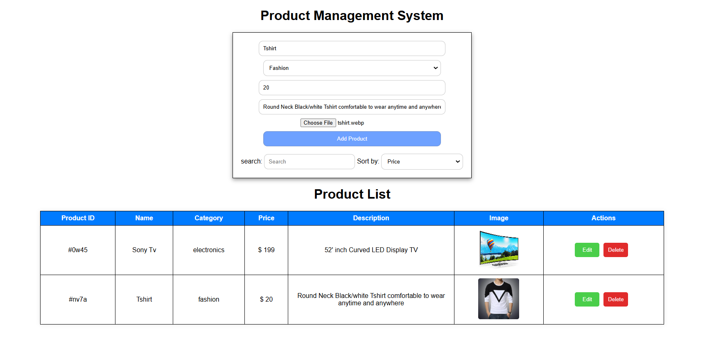
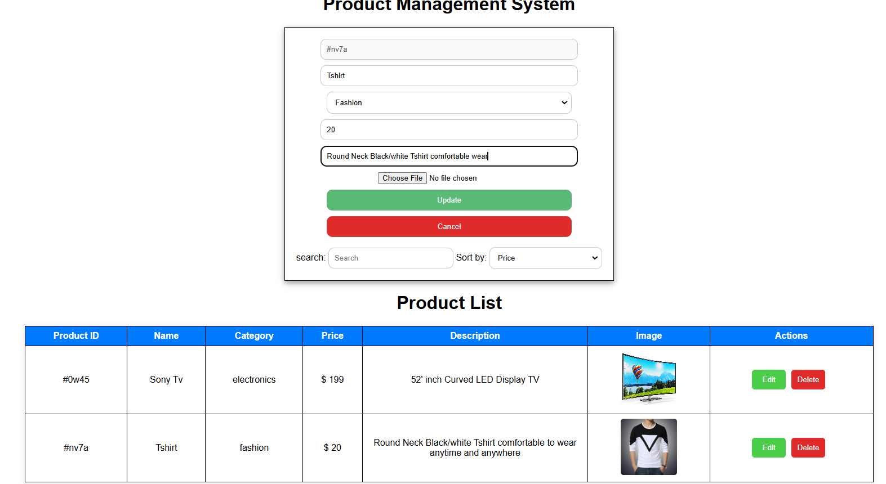

# CRUD-JS Product Management

A simple **CRUD (Create, Read, Update, Delete) JavaScript Project** that allows users to manage products using **HTML, CSS, and JavaScript**. This project also includes **local storage support**, a **search feature**, and **sorting functionality** based on product name and price.

## Features

✅ **Add Product** – Users can add a new product with details like name, price, and description.  
✅ **Edit/Update Product** – Users can modify existing product details.  
✅ **Delete Product** – Users can remove a product from the list.  
✅ **Search Product** – Users can search for products using keywords.  
✅ **Sort Products** – Sorting is available based on **name (A-Z, Z-A)** and **price (Low to High, High to Low)**.  
✅ **Local Storage Support** – All data is stored in the browser's local storage, ensuring persistence.  

## Technologies Used

- **HTML** – Structure of the web page.
- **CSS** – Styling for better user experience.
- **JavaScript** – Functionality, including CRUD operations, sorting, and searching.
- **Local Storage** – To store products persistently in the browser.

## How to Run the Project

1. Clone or download this repository.
2. Open the `index.html` file in a web browser.
3. Start adding, editing, deleting, searching, and sorting products.

## Screenshots

## Future Enhancements

🚀 Implement product categories    
🚀 Improve UI/UX with animations  
🚀 Use an external database for storage  

## Author

**Kabir Navadiya**  

Feel free to contribute or suggest improvements! ✨

